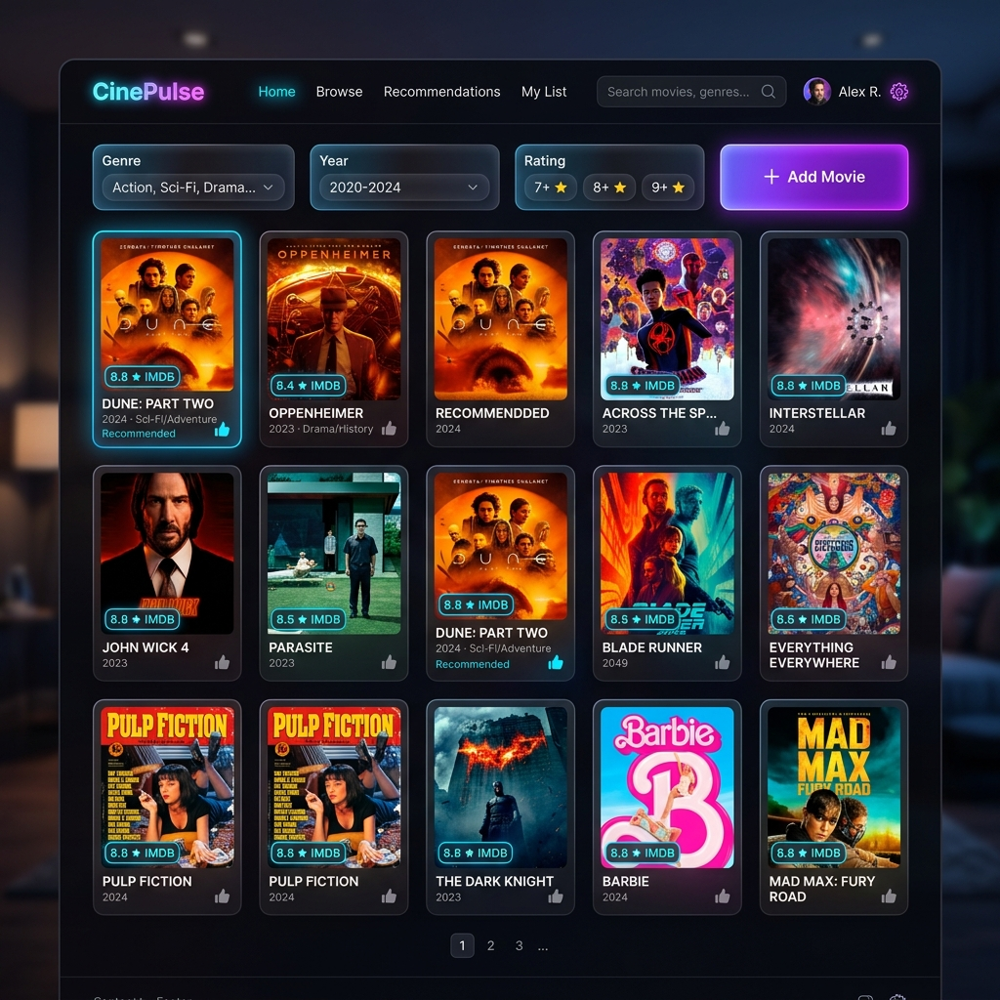

# 🎬 CineVault - Movie Recommendation Hub

[](https://nodejs.org/)
[](https://expressjs.com/)
[](https://developer.mozilla.org/en-US/docs/Web/JavaScript)
[](https://opensource.org/licenses/MIT)

> **Experience Cinema in High-Fidelity.** A premium, full-stack movie recommendation platform built with a cinematic aesthetic and high-performance RESTful architecture.

---

## ✨ Project Preview



*CineVault features a dark-mode, glassmorphic interface designed to provide a high-end cinematic experience directly in your browser.*

---

## 🚀 Features

### **🎨 Premium UI/UX**
- **Glassmorphic Design**: Soft blurs, vibrant overlays, and a curated HSL-based dark palette.
- **Micro-Animations**: Fluid transitions (0.4s cubic-bezier) and hover states that feel alive.
- **Skeleton Loaders**: Engineered for a seamless "perceived performance" during I/O.
- **Responsive Navigation**: Adapts to desktop, tablet, and mobile with a sidebar/bottom-nav hybrid.

### **💾 Full-Stack Functionality**
- **Dynamic CRUD Engine**: Effortlessly Add, Update, and Delete movies from your library.
- **Smart Filtering**: Real-time filtering by rating (1-5 stars).
- **In-Memory Store**: Fast data access powered by a Node.js Express backend.
- ** पोस्टर-प्रथम Visuals**: Automated poster management with interactive hover details.

---

## 🛠️ Technology Stack

- **Backend**: [Node.js](https://nodejs.org/) + [Express](https://expressjs.com/) (RESTful API)
- **Frontend**: Vanilla JavaScript (ES6+), HTML5 Semantic Tags
- **Styling**: Pure CSS3 with Custom Design Tokens
- **ID Generation**: [uuid](https://www.npmjs.com/package/uuid) v9
- **Dev Tools**: [Nodemon](https://www.npmjs.com/package/nodemon)

---

## 🚦 Getting Started

### **1. Prerequisites**
Ensure you have **Node.js** (v18+) and **npm** installed on your system.

### **2. Installation**
Clone the repository and install the dependencies:

```bash
git clone https://github.com/johnphilji/Postlab-1---4B.git
cd Postlab-1---4B
npm install
```

### **3. Launch the Application**
Run the server in development mode:

```bash
npm run dev
```

The application will be live at `http://localhost:3007`.

---

## 📡 API Reference

| Endpoint | Method | Description |
| :--- | :---: | :--- |
| `/movies` | `GET` | Fetch all movies (Supports `?rating=N` filter) |
| `/movies` | `POST` | Add a new movie to the collection |
| `/movies/:id` | `PATCH` | Update specific fields of a movie |
| `/movies/:id` | `DELETE`| Remove a movie from the database |

---

## 📁 Project Structure

```text
├── assets/             # Images and visual assets for the README
├── public/             # Frontend assets (index.html, style.css, app.js)
│   └── images/         # Local movie poster storage
├── server.js           # Express server & REST API endpoints
├── package.json        # Main configuration and script definitions
└── README.md           # Documentation (You are here!)
```

---

## 📄 License
This project is licensed under the **MIT License**. Feel free to use and modify it as you see fit.

---

*Built with ❤️ for a superior movie browsing experience.*